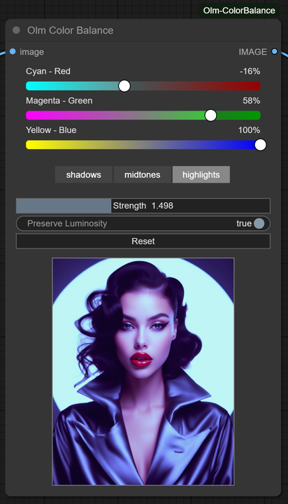

# Olm Color Balance for ComfyUI



An interactive, **color balance** adjustment node for ComfyUI, featuring a clean interface and realtime preview.

- **Author:** Olli Sorjonen
- **GitHub:** https://github.com/o-l-l-i
- **X:** https://x.com/Olmirad
- **Version:** 1.0.1 (Preview improvements, code cleanup)

---

## ✨ What Is This?

**Olm Color Balance** is a fast, lightweight, and highly responsive color adjustment node for ComfyUI.
Inspired by typical art app "Color Balance" feature, it lets you fine-tune shadows, midtones, and highlights by shifting the RGB balance across the tonal range — all in real time.

If you’re tired of heavy multi-node bundles for this specific task, this tool is for you.

Use it for:

- Subtle or bold color grading
- Stylizing images to match a desired tone
- Matching images for compositing
- Emulating analog film or cinematic color response

---

## 🎯 Why Use This?

- 🧩 **Standalone and Focused**
  - Not part of a bulky node suite.

- ⚡ **Minimal Dependencies**
  - Built using only `Pillow`, `Torch`, and `NumPy`.
  - No extra models, weights, servers, or external assets.

- 🖼️ **Live Preview**
  - See the result directly in the node — no need to re-run the full graph for every tweak.

- 🧘 **Smooth UX**
  - Compact and neat.
  - Resize the node for larger sliders and preview image.
  - Everything responds immediately.

---

## 🎨 Features

### 🎛️ Classic Color Balance Controls

Each tonal range — **Shadows**, **Midtones**, and **Highlights** — has three sliders:

| Range     | Adjustable Channels   |
|-----------|------------------------|
| Shadows   | Cyan–Red, Magenta–Green, Yellow–Blue |
| Midtones  | Cyan–Red, Magenta–Green, Yellow–Blue |
| Highlights| Cyan–Red, Magenta–Green, Yellow–Blue |

All changes are applied smoothly, with tonemapped masks to isolate the ranges, producing smooth, natural-looking results.

### ⚡ Realtime Feedback

- Instantly updates preview inside the node.
- Designed for fast iteration and creative exploration.
- Fully resizable interface and slider layout.

---

## 📦 Installation

Clone this repository into your `custom_nodes` folder.

```bash
git clone https://github.com/o-l-l-i/ComfyUI-Olm-ColorBalance.git
```

Your folder structure should look like:

```bash
ComfyUI/
└── custom_nodes/
    └── ComfyUI-Olm-ColorBalance/
        ├── __init__.py
        ├── olm_colorbalance.py
        └── ... (other files)
```

Restart ComfyUI to load the new node.

✅ No extra dependencies — works out of the box.

---

## 🧪 Basic Usage

1. Load an image using a Load Image node.
2. Connect it to the Olm Color Balance node.
3. Run the graph once to generate a preview image in the node.
4. Adjust the sliders under Shadows, Midtones, and Highlights to color-correct or stylize.
5. Observe real-time updates in the node’s preview area.
6. Use the output image as input to any other node in your workflow.

---

## ⚠️ Known Limitations

- Realtime preview only activates after the graph is run once.
- Best results are obtained with uncompressed RGB images.
- Currently limited to RGB image inputs.
- No mask support/pass-through.
- Fine adjustments may be needed to avoid clipping in extreme highlights or shadows.
- This is a creative node — it doesn’t do automatic white balance/contrast correction etc.
- Performance is generally fast, but scales with image size.

---

## 💬 Notes

This extension is experimental and under active development. Functionality, behavior, and internal logic may change without notice.

Use at your own risk in your workflows. Back up your work often.

Feedback and suggestions are welcome — but expect bugs, sharp edges, and features to evolve as time allows.

---

## License & Usage Terms

Copyright (c) 2025 Olli Sorjonen

This project is source-available, but not open-source under a standard open-source license, and not freeware.
You may use and experiment with it freely, and any results you create with it are yours to use however you like.

However:

Redistribution, resale, rebranding, or claiming authorship of this code or extension is strictly prohibited without explicit written permission.

Use at your own risk. No warranties or guarantees are provided.

The only official repository for this project is: 👉 https://github.com/o-l-l-i/ComfyUI-Olm-ColorBalance

---

## Author

Created by [@o-l-l-i](https://github.com/o-l-l-i)